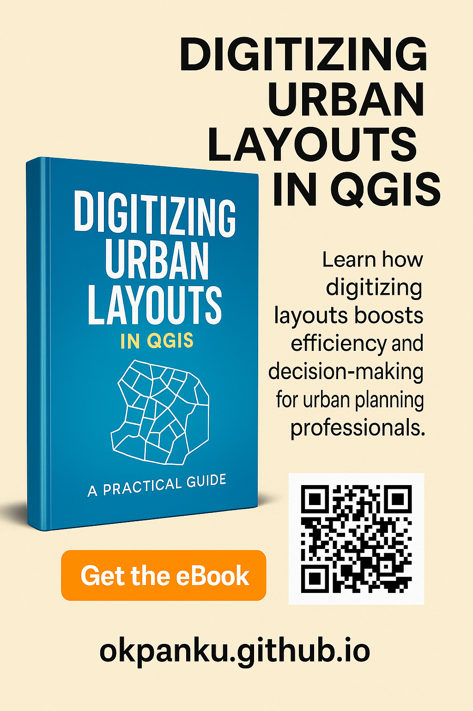

# 📘 Digital Layout Approvals

## A Practical Guide for Nigerian Urban Planners  
**By Okpanku Chimaobi**

---

### Learn how to:
✅ Digitize site layouts using QGIS and PostGIS  
✅ Validate plots and enforce zoning regulations  
✅ Generate internal revenue from layout approvals  
✅ Set up a local GIS studio for planning departments  
✅ Automate approvals, track workflows, and prevent data loss  

---

📘 **Read Chapter 2 preview:**  
👉 [**Chapter 2: Why Digitizing Layouts Matters**](Digital_Layout_Approvals_Chapter2.html)

📘 [**View Full Table of Contents**](Digital_Layout_Approvals_Table_of_Contents.html)

📚 <a href="https://wa.me/2348131252013?text=Hello%2C%20I'm%20interested%20in%20the%20Digital%20Layout%20Approvals%20eBook.%20Please%20share%20more%20details." target="_blank">[**Buy Full eBook**]</a> *(eBook Coming Out Soon!!)*

---

> Powered by GIS. Backed by Local Innovation.  
> _"Planning is not just maps. It’s policy made visible."_
